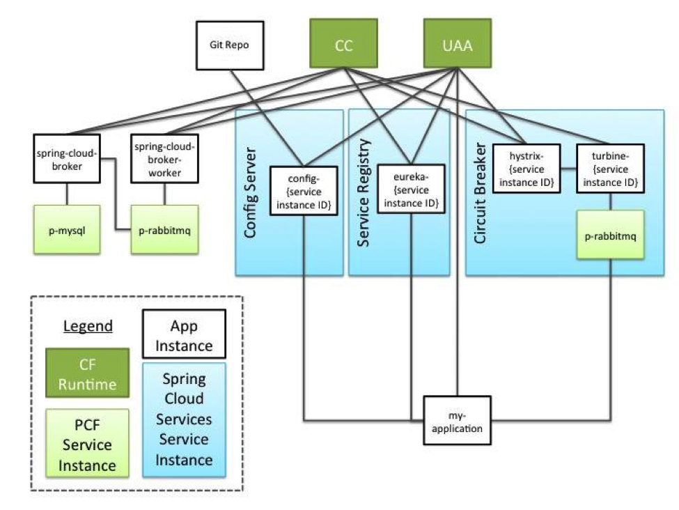

# playSpringCloud

## Reference
- [samples](https://github.com/spring-cloud-samples)
- [Spring Cloud Netflix](https://cloud.spring.io/spring-cloud-netflix/)
- [Centralized Configuration](https://spring.io/guides/gs/centralized-configuration/)
- [Circuit Breaker](https://spring.io/guides/gs/circuit-breaker/)
- [Routing and Filtering](https://spring.io/guides/gs/routing-and-filtering/) 
- [Client Side Load Balancing with Ribbon and Spring Cloud](https://spring.io/guides/gs/client-side-load-balancing/)

### The project contains three parts
  - Spring Cloud Config
  - Spring Cloud Eureka
    Service Discovery: Eureka instances can be registered and clients can discover the instances using Spring-managed beans
    Service Discovery: an embedded Eureka server can be created with declarative Java configuration
  - [playSpring](https://github.com/Prussia/playSpring)
  
  

### Spring Cloud
  是微服务工具包，为开发者提供了在分布式系统的配置管理、服务发现、断路器、智能路由、微代理、控制总线等开发工具包。
- Eureka:　服务注册发现框架
- Zuul:　服务网关
- Karyon:　服务端框架
- Ribbon:　客户端框架
- Hystrix: 服务容错组件
- Archaius: 服务配置组件
- Servo: Metrics组件
- Blitz4j: 日志组件

### Spring Cloud子项目
- Spring Cloud Config：配置管理开发工具包，可以让你把配置放到远程服务器，目前支持本地存储、Git以及Subversion。

  

- Spring Cloud Bus：事件、消息总线，用于在集群（例如，配置变化事件）中传播状态变化，可与Spring Cloud Config联合实现热部署。
  
  
  
- Spring Cloud Netflix：针对多种Netflix组件提供的开发工具包，其中包括Eureka、Hystrix、Zuul、Archaius等。
  - Netflix Eureka：云端负载均衡，一个基于 REST 的服务，用于定位服务，以实现云端的负载均衡和中间层服务器的故障转移。

  

  - Netflix Hystrix：容错管理工具，旨在通过控制服务和第三方库的节点,从而对延迟和故障提供更强大的容错能力。
  - Netflix Zuul：边缘服务工具，是提供动态路由，监控，弹性，安全等的边缘服务。
  - Netflix Archaius：配置管理API，包含一系列配置管理API，提供动态类型化属性、线程安全配置操作、轮询框架、回调机制等功能。
- Spring Cloud for Cloud Foundry：通过Oauth2协议绑定服务到CloudFoundry，CloudFoundry是VMware推出的开源PaaS云平台。
- Spring Cloud Sleuth：日志收集工具包，封装了Dapper,Zipkin和HTrace操作。
- Spring Cloud Data Flow：大数据操作工具，通过命令行方式操作数据流。
- Spring Cloud Security：安全工具包，为你的应用程序添加安全控制，主要是指OAuth2。
- Spring Cloud Consul：封装了Consul操作，consul是一个服务发现与配置工具，与Docker容器可以无缝集成。
- Spring Cloud Zookeeper：操作Zookeeper的工具包，用于使用zookeeper方式的服务注册和发现。
- Spring Cloud Stream：数据流操作开发包，封装了与Redis,Rabbit、Kafka等发送接收消息。
- Spring Cloud CLI：基于 Spring Boot CLI，可以让你以命令行方式快速建立云组件。

