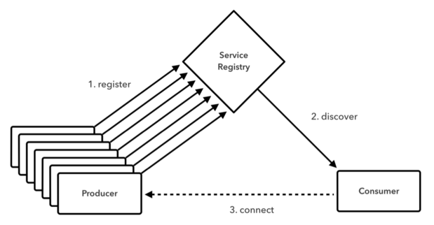
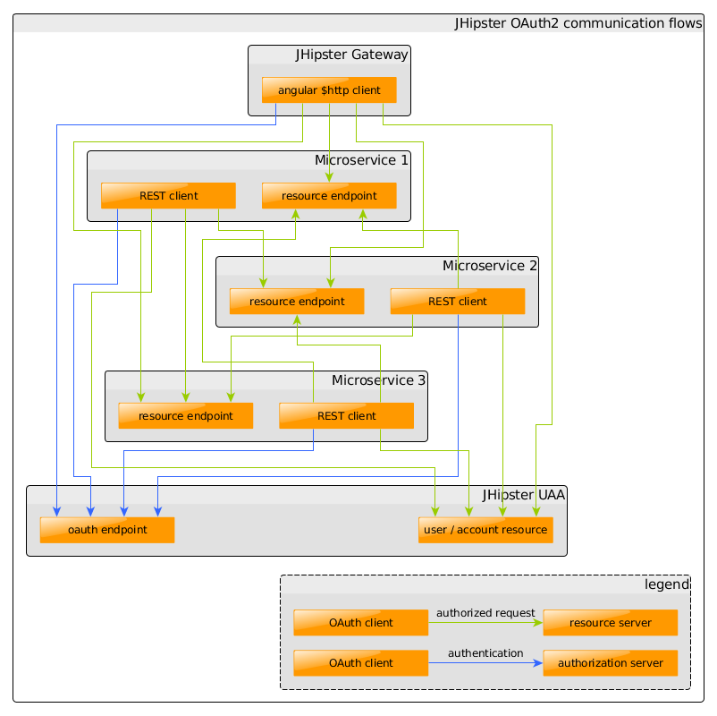
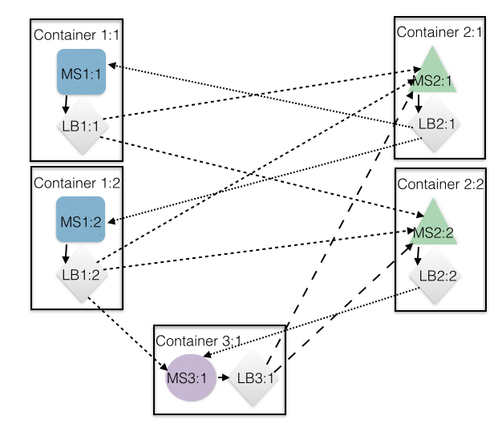

# playSpringCloud

## Reference
- [Spring Cloud Netflix](https://cloud.spring.io/spring-cloud-netflix/)
- [Doing microservices with JHipster](https://jhipster.github.io/microservices-architecture/)
  - 
- [spring cloud samples](https://github.com/spring-cloud-samples)
  - eureka
    - [Service Discovery](https://github.com/spring-cloud-samples/eureka)
    - 
  - config 
    - [Centralized Configuration](https://spring.io/guides/gs/centralized-configuration/)
    - 
  - uaa 
    - [User Account and Authentication](https://github.com/cloudfoundry/uaa)
    - [Component: User Account and Authentication (UAA) Server](http://docs.cloudfoundry.org/concepts/architecture/uaa.html)
    - [using-uaa](https://jhipster.github.io/using-uaa/)
    - 
  - Hystrix
    - [Circuit Breaker](https://spring.io/guides/gs/circuit-breaker/)
  - Zuul 
    - [Routing and Filtering](https://spring.io/guides/gs/routing-and-filtering/) 
    - Embedded Reverse Proxy
    - http://techblog.netflix.com/2013/06/announcing-zuul-edge-service-in-cloud.html
  - Ribbon 
    - [Client Side Load Balancing with Ribbon and Spring Cloud](https://spring.io/guides/gs/client-side-load-balancing/)
    - 
### [Overview](https://docs.cloudfoundry.org/concepts/architecture/)
    CC: The Cloud Foundry Cloud Controller.
    CC DB: The Cloud Controller database.
    CF: Cloud Foundry.
    CF Application: An application in Cloud Foundry; the application in cf push application.
    Dashboard SSO: Cloud Foundry’s Dashboard Single Sign-On.
    domain.com: The value configured by an administrator for the Cloud Foundry system domain.
    Eureka Application Name: The identifier used by a CF Application to look up other CF Applications that are registered with a Spring Cloud Services Service Registry service instance. A CF Application that registers with a Spring Cloud Services Service Registry service instance will use the value of its spring.application.name property for this value by default.
    FQDN: Fully Qualified Domain Name.
    Instance Record: In Eureka, the core domain object; represents a CF Application that has registered with a Spring Cloud Services Service Registry service instance. An Instance Record is used to map a Virtual Hostname to a physical route (e.g. hostname, IP address, and port). An Instance Record can have metadata associated with it.
    Operator: A user of Pivotal Cloud Foundry® Operations Manager.
    SB: The Spring Cloud Services Service Broker.
    SCS: Spring Cloud Services.
    UAA: The Cloud Foundry User Account and Authentication Server.
  
  

### Spring Cloud 
  是微服务工具包，为开发者提供了在分布式系统的配置管理、服务发现、断路器、智能路由、微代理、控制总线等开发工具包。
- Eureka:　服务注册发现框架 Service Discovery
  
- Zuul:　服务网关 Intelligent Routing
- Karyon:　服务端框架
- Ribbon:　客户端框架  Client Side Load Balancing

- Hystrix: 服务容错组件
- Archaius: 服务配置组件
- Servo: Metrics组件
- Blitz4j: 日志组件

### Spring Cloud子项目
- [Spring Cloud Config：配置管理开发工具包，可以让你把配置放到远程服务器，目前支持本地存储、Git以及Subversion。](https://docs.pivotal.io/spring-cloud-services/1-3/common/config-server/)

  

- Spring Cloud Bus：事件、消息总线，用于在集群（例如，配置变化事件）中传播状态变化，可与Spring Cloud Config联合实现热部署。
  
  
  
- [Spring Cloud Netflix](https://github.com/spring-cloud/spring-cloud-netflix)：针对多种Netflix组件提供的开发工具包，其中包括Eureka、Hystrix、Zuul、Archaius等。
  - [Netflix Eureka：云端负载均衡，一个基于 REST 的服务，用于定位服务，以实现云端的负载均衡和中间层服务器的故障转移。](https://docs.pivotal.io/spring-cloud-services/1-3/common/service-registry/)
  - Netflix Hystrix：容错管理工具，旨在通过控制服务和第三方库的节点,从而对延迟和故障提供更强大的容错能力。
  - Netflix Zuul：边缘服务工具，是提供动态路由，监控，弹性，安全等的边缘服务。
  - Netflix Archaius：配置管理API，包含一系列配置管理API，提供动态类型化属性、线程安全配置操作、轮询框架、回调机制等功能。
- Spring Cloud for Cloud Foundry：通过Oauth2协议绑定服务到CloudFoundry，CloudFoundry是VMware推出的开源PaaS云平台。
- Spring Cloud Sleuth：日志收集工具包，封装了Dapper,Zipkin和HTrace操作。
- Spring Cloud Data Flow：大数据操作工具，通过命令行方式操作数据流。
- [Spring Cloud Security](http://cloud.spring.io/spring-cloud-security/spring-cloud-security.html)：安全工具包，为你的应用程序添加安全控制，主要是指OAuth2。
- Spring Cloud Consul：封装了Consul操作，consul是一个服务发现与配置工具，与Docker容器可以无缝集成。
- Spring Cloud Zookeeper：操作Zookeeper的工具包，用于使用zookeeper方式的服务注册和发现。
- Spring Cloud Stream：数据流操作开发包，封装了与Redis,Rabbit、Kafka等发送接收消息。
- Spring Cloud CLI：基于 Spring Boot CLI，可以让你以命令行方式快速建立云组件。

