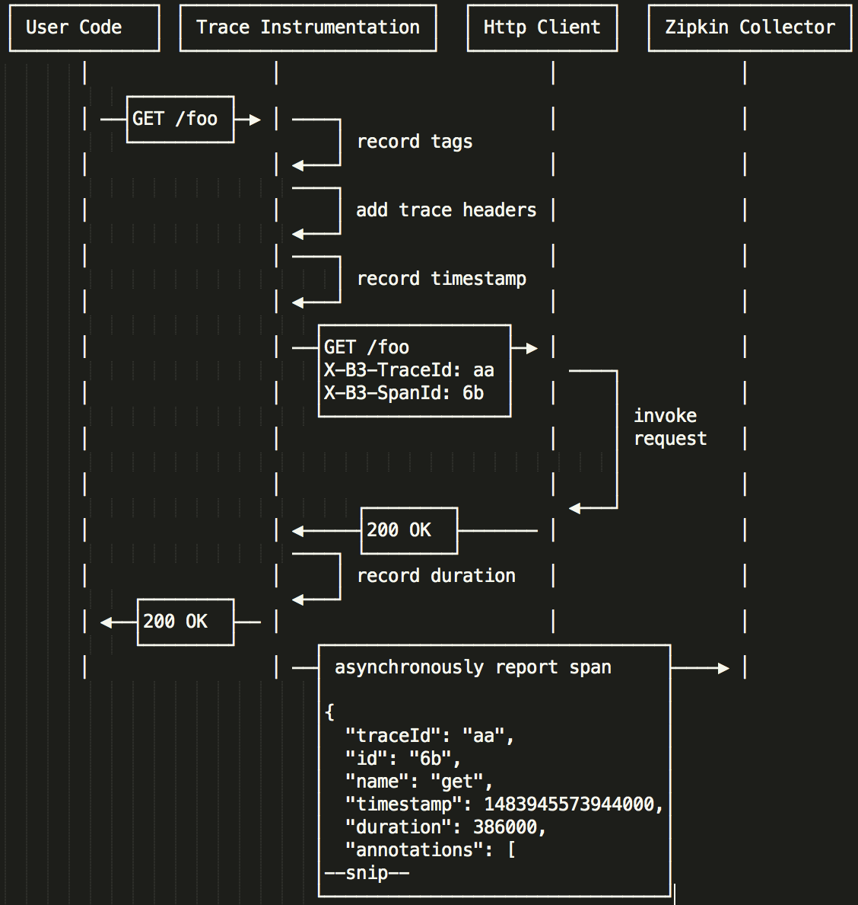

# [Sleuth](https://github.com/spring-cloud/spring-cloud-sleuth#terminology)

- span id and trace id
	
- [zipkin](https://github.com/openzipkin/zipkin)
	- [architecture](http://zipkin.io/pages/architecture.html)
		
		There are 4 components that make up Zipkin:  collector, storage, search, web UI
		
	- Example flow	
		
	
